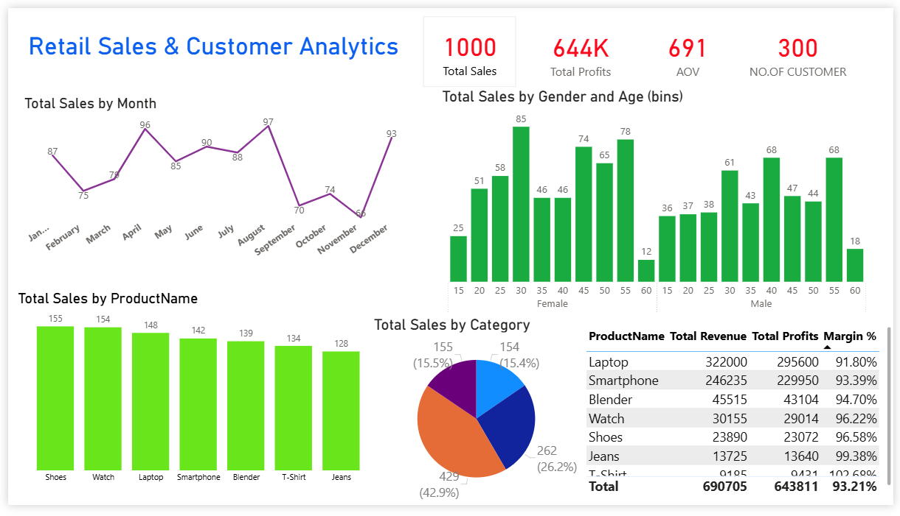

# Retail Sales and Customer Sales
This Power BI project analyzes one year of sales, customer, store, and product data for UrbanMart, a fictional multi-city retail chain. The dashboard delivers actionable insights on sales performance, customer behavior, and store operations to help management make data-driven decisions

## Overview
This project analyzes one year of sales, customer, store, and product data for **UrbanMart**, a fictional multi-city retail chain.  
The goal is to build an interactive **Power BI dashboard** that provides actionable insights into sales performance, customer behavior, product profitability, and store operations.

## Dashboard

## Screenshot
<a href="https://github.com/Siddaling1/Power-bi-Project/blob/main/Screenshot%20of%20Power%20Bi%20Dashboard.png">Screenshot</a>

## Dashboard Features
Total Sales

Total Profit

Average Order Value

Number of Customers

Sales trend over time

Top-selling products

Sales by category

Sales by gender and age group

Product margin analysis
